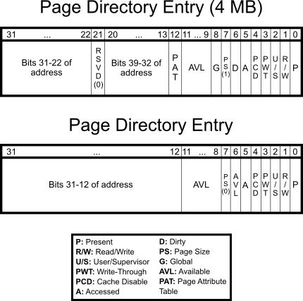
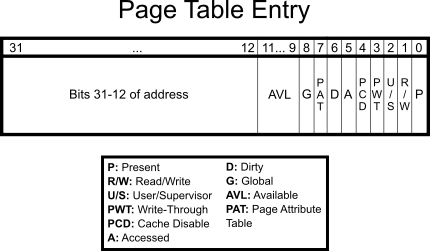
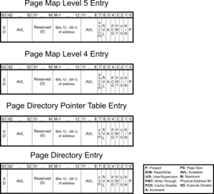
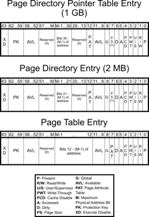

# Page

## 32-bit
### Page Directory

### Page Table

## 64-bit

# 参考资料
*  [Understanding x86_64 Paging](https://github.com/zolutal/zolutal.github.io/blob/master/_posts/2023-12-27-understanding-paging.md)
*  [Paging](https://wiki.osdev.org/Paging)