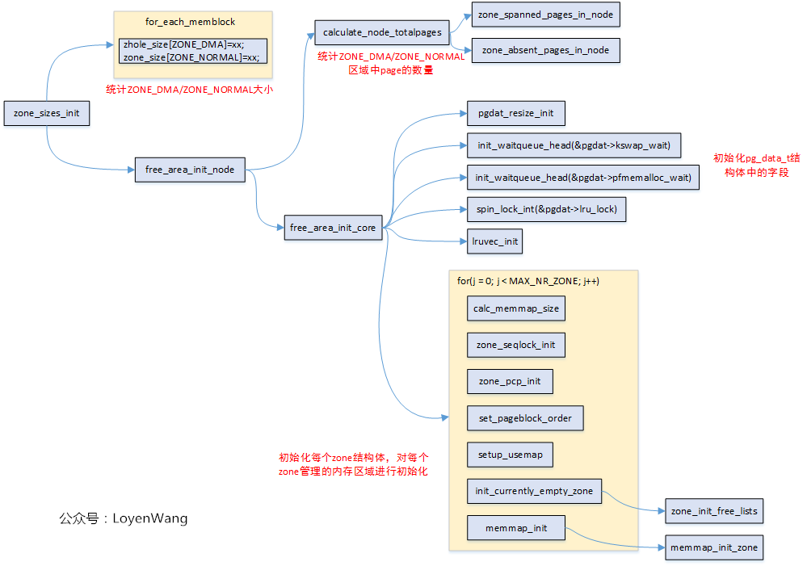

# zone

在Linux中，物理内存地址区域采用zone来管理。
```c
void __init bootmem_init(void)
{
	unsigned long min, max;

	min = PFN_UP(memblock_start_of_DRAM());
	max = PFN_DOWN(memblock_end_of_DRAM());

	zone_sizes_init(min, max);
}
```

在NUMA架构下，每一个Node都会对应一个struct pglist_data，在UMA架构中只会使用唯一的一个struct pglist_data结构

[](https://img2018.cnblogs.com/blog/1771657/201909/1771657-20190922175109570-1337394305.png)

```c
struct zone {
	unsigned long watermark[NR_WMARK];  //水位值，WMARK_MIN/WMARK_LOV/WMARK_HIGH，页面分配器和kswapd页面回收中会用到
	long lowmem_reserve[MAX_NR_ZONES];  //zone中预留的内存

	struct pglist_data	*zone_pgdat;    //执行所属的pglist_data
	struct per_cpu_pageset __percpu *pageset;

	/* zone_start_pfn == zone_start_paddr >> PAGE_SHIFT */
	unsigned long		zone_start_pfn; //ZONE的起始内存页面帧号
    unsigned long managed_pages;    //被Buddy System管理的页面数量
    unsigned long spanned_pages;     //ZONE中总共的页面数，包含空洞的区域
    unsigned long present_pages;      //ZONE里实际管理的页面数量

	/* free areas of different sizes */
	struct free_area	free_area[MAX_ORDER];
} ____cacheline_internodealigned_in_smp;

struct zonelist {
	struct zonelist_cache *zlcache_ptr;		     // NULL or &zlcache
	struct zoneref _zonerefs[MAX_ZONES_PER_ZONELIST + 1];
};

typedef struct pglist_data {
	struct zone node_zones[MAX_NR_ZONES];
	struct zonelist node_zonelists[MAX_ZONELISTS];
	int nr_zones;

	unsigned long node_start_pfn;
	unsigned long node_present_pages; /* total number of physical pages */
	unsigned long node_spanned_pages; /* total size of physical page range, including holes */

	wait_queue_head_t pfmemalloc_wait;
	struct task_struct *kswapd;	/* Protected by mem_hotplug_begin/end() */
} pg_data_t;
```


---

**参考**
* [Linux内存管理zone_sizes_init](https://www.cnblogs.com/LoyenWang/p/11568481.html)